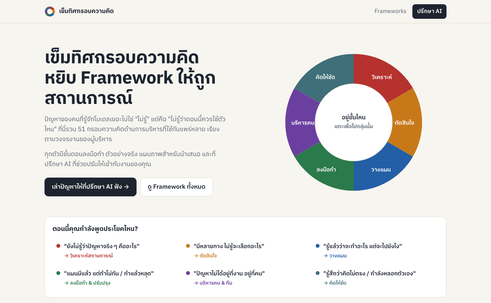
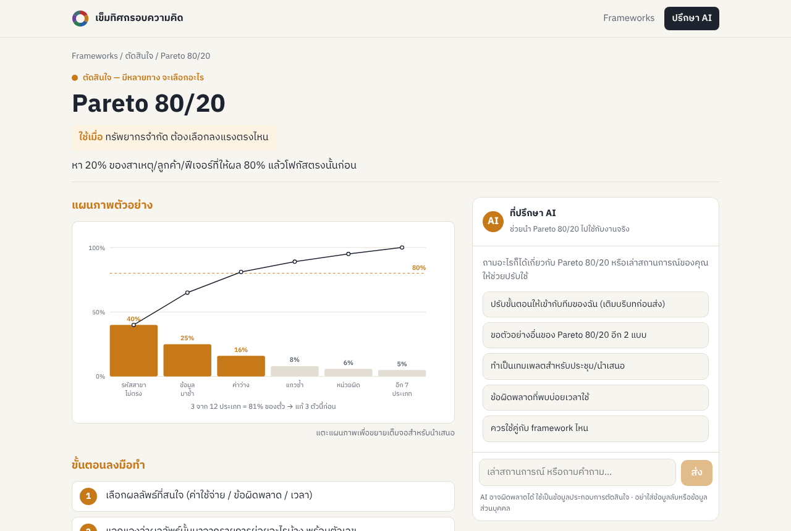
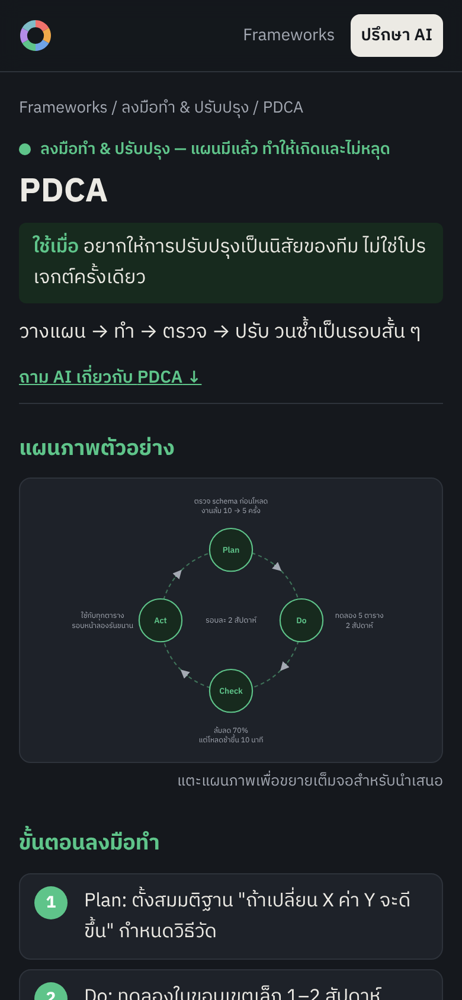
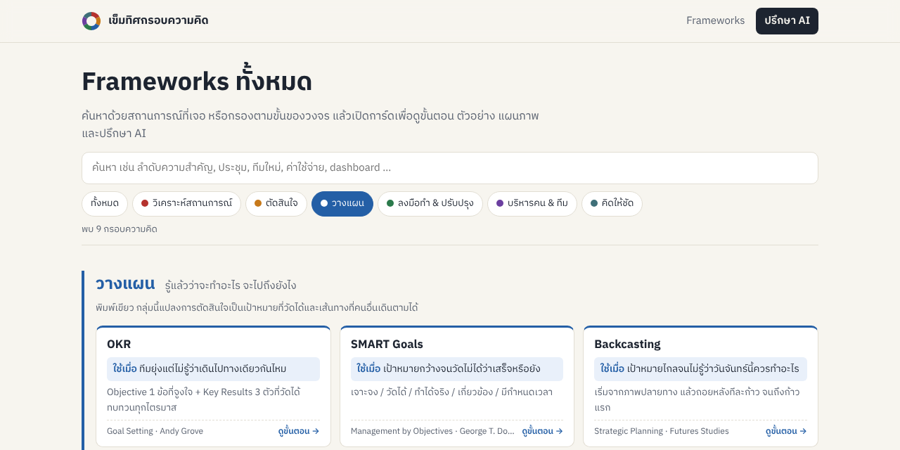
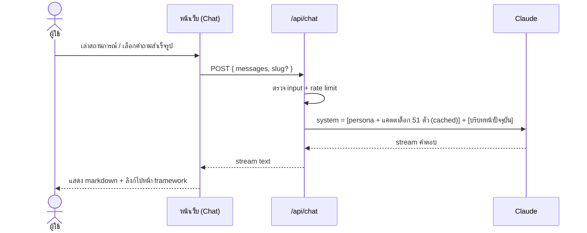
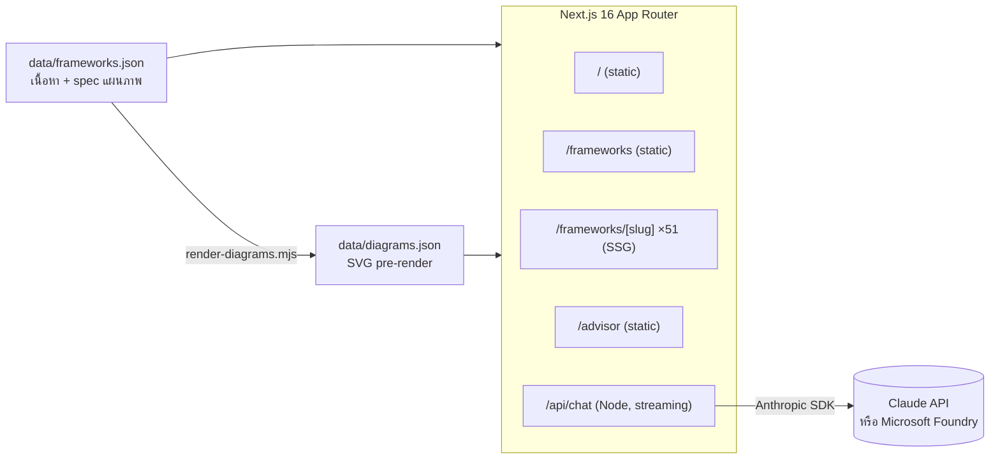

# เข็มทิศกรอบความคิด
### Management Framework Learning Hub + AI Advisor

> **ปัญหาของคนที่รู้จัก framework เยอะไม่ใช่ "ไม่รู้" แต่คือ "ไม่รู้ว่าตอนนี้ควรใช้ตัวไหน"**

เว็บไซต์สำหรับเรียนรู้และ**นำ management framework ไปใช้จริง** รวม 51 กรอบความคิด จัดกลุ่มตาม *คำถามที่ผู้บริหารกำลังถามอยู่* (ไม่ใช่ตามทฤษฎีหรือชื่อผู้คิดค้น) ทุกตัวมีขั้นตอนลงมือทำ ตัวอย่างจริง และแผนภาพสำหรับนำเสนอ พร้อม **ที่ปรึกษา AI ระดับผู้เชี่ยวชาญ** ที่ช่วยวินิจฉัยสถานการณ์ แนะนำ framework ที่เหมาะ และปรับขั้นตอนให้เข้ากับงานของคุณ



---

## สารบัญ

- [ทำไมต้องมีเว็บนี้](#ทำไมต้องมีเว็บนี้)
- [ฟีเจอร์](#ฟีเจอร์)
- [Framework ทั้ง 51 ตัว](#framework-ทั้ง-51-ตัว)
- [ที่ปรึกษา AI ทำงานอย่างไร](#ที่ปรึกษา-ai-ทำงานอย่างไร)
- [สถาปัตยกรรม](#สถาปัตยกรรม)
- [เริ่มใช้งาน](#เริ่มใช้งาน)
- [ตัวแปร Environment](#ตัวแปร-environment)
- [Deploy แบบ static บน GitHub Pages](#deploy-แบบ-static-บน-github-pages)
- [Deploy บน Azure (รวมที่ปรึกษา AI)](#deploy-บน-azure-รวมที่ปรึกษา-ai)
- [เพิ่มหรือแก้ไข Framework](#เพิ่มหรือแก้ไข-framework)
- [Roadmap](#roadmap)
- [ลิขสิทธิ์และเครื่องหมายการค้า](#ลิขสิทธิ์และเครื่องหมายการค้า)
- [เครดิตแนวคิด](#เครดิตแนวคิด)

---

## ทำไมต้องมีเว็บนี้

ตำราส่วนใหญ่เรียง framework ตามสาขาวิชา แต่ตอนเจอปัญหาจริง เราจำได้แค่ว่า **"ติดอยู่ตรงไหน"** เว็บนี้จึงจัดทุกอย่างตามวงจรงานของผู้บริหาร:

```
        ┌──────────── คิดให้ชัด (เลนส์ที่ใช้ทับทุกขั้น) ────────────┐
        │                                                           │
   วิเคราะห์ ──▶ ตัดสินใจ ──▶ วางแผน ──▶ ลงมือทำ ──▶ บริหารคน ──┐
        ▲                                                       │
        └───────────────────────────────────────────────────────┘
```

| ถ้าคุณกำลังพูดว่า… | ไปที่กลุ่ม | สี |
|---|---|---|
| "ยังไม่รู้ว่าปัญหาจริง ๆ คืออะไร" | วิเคราะห์สถานการณ์ | 🔴 แดง — สัญญาณเตือน |
| "มีหลายทาง ไม่รู้จะเลือกอะไร" | ตัดสินใจ | 🟠 เหลืองอำพัน — ทางแยก |
| "รู้แล้วว่าจะทำอะไร แต่จะไปยังไง" | วางแผน | 🔵 น้ำเงิน — พิมพ์เขียว |
| "แผนมีแล้ว แต่ทำไม่ทัน / ทำแล้วหลุด" | ลงมือทำ & ปรับปรุง | 🟢 เขียว — ไปได้ |
| "ปัญหาไม่ได้อยู่ที่งาน อยู่ที่คน" | บริหารคน & ทีม | 🟣 ม่วง — เรื่องของคน |
| "รู้สึกว่าคิดไม่ตรง / กำลังหลอกตัวเอง" | คิดให้ชัด | 🩵 เขียวคราม — น้ำใส |

**ระบบสีมีเหตุผล:** ไล่จากร้อนไปเย็นตาม "ความเสี่ยงที่ความรู้สึกจะแทรกการตัดสินใจ" ส่วนม่วงและเขียวครามแยกออกมาเพราะเป็นมิติคนละแกน

---

## ฟีเจอร์

### 📚 เรียนรู้
- **เข็มทิศ 6 ขั้น** หน้าแรก แตะส่วนไหนก็ไปกลุ่มนั้นทันที
- **ค้นหาด้วยสถานการณ์** เช่น "ประชุม", "ทีมใหม่", "ค่าใช้จ่าย" ระบบค้นทั้งชื่อ ขั้นตอน และตัวอย่าง
- **การ์ดอ่านจบใน 10 วินาที:** ใช้เมื่อไหร่ → ทำยังไง 1 บรรทัด

### 🛠️ นำไปใช้จริง
แต่ละ framework มีหน้าของตัวเอง ประกอบด้วย:
- **ขั้นตอนลงมือทำ 5 ข้อ** เรียงลำดับพร้อมทำตาม
- **ตัวอย่างสถานการณ์สมมติ** ในบริบททีมข้อมูลและเทคโนโลยี (pipeline, dashboard, คุณภาพข้อมูล, ภาระงานทีม ฯลฯ)
- **แผนภาพประกอบ** ในรูปแบบที่เหมาะกับแต่ละตัว (Matrix 2×2, Workflow, Fishbone, Pyramid, Swimlane, Gantt, Decision tree, ตาราง) **แตะเพื่อขยายเต็มจอสำหรับนำเสนอ**

### 🤖 ที่ปรึกษา AI
- **หน้า `/advisor`** เล่าสถานการณ์ แล้ว AI จะถามคำถามวินิจฉัย แนะนำ framework ไม่เกิน 3 ตัว พร้อมลำดับการใช้และลิงก์ไปยังหน้านั้น
- **AI ประจำแต่ละหน้า framework** ช่วยปรับขั้นตอนให้เข้ากับทีมคุณ ขอตัวอย่างเพิ่ม ทำเทมเพลตสำหรับประชุม หรือบอกว่าควรใช้คู่กับตัวไหน
- ตอบเป็นภาษาไทย แสดงผลทีละส่วน (streaming) รองรับตาราง markdown สำหรับนำไปนำเสนอต่อ

### 📱 ใช้ได้ทุกที่
รองรับมือถือ, dark mode และหน้า framework ทั้งหมดเป็น static page โหลดเร็ว

<table>
  <tr>
    <td width="68%"></td>
    <td rowspan="2" align="center"></td>
  </tr>
  <tr>
    <td></td>
  </tr>
</table>

<sub>ซ้ายบน: หน้ารายละเอียด framework · ซ้ายล่าง: ค้นหาและกรองตามกลุ่ม · ขวา: มือถือ (dark mode)</sub>

---

## Framework ทั้ง 51 ตัว

<!-- สร้างจาก data/frameworks.json -->

<details>
<summary><b>🔴 วิเคราะห์สถานการณ์</b> — ปัญหาจริงคืออะไร เกิดจากอะไร (8)</summary>

| Framework | ใช้เมื่อ |
|---|---|
| 5 Whys | ปัญหาเดิมเกิดซ้ำ แก้แล้วแก้อีก |
| Fishbone (Ishikawa) | ปัญหามีหลายสาเหตุพันกัน ทีมเถียงกันว่าเพราะอะไร |
| SWOT | เริ่มโปรเจกต์ / ทบทวนทีม / ก่อนคุยกลยุทธ์ |
| PESTEL | ต้องอ่านสภาพแวดล้อมภายนอกที่ควบคุมไม่ได้ |
| Porter's 5 Forces | ประเมินว่าธุรกิจ/ผลิตภัณฑ์นี้น่าอยู่ในตลาดนี้ไหม |
| First Principles | คำตอบเดิม ๆ ตันแล้ว ทุกคนทำตามกันมาโดยไม่รู้ว่าทำไม |
| Gap Analysis | รู้เป้าหมาย รู้สถานะปัจจุบัน แต่ยังไม่รู้ว่าห่างกันตรงไหน |
| Iceberg Model | แก้เหตุการณ์แล้วก็เกิดใหม่ในรูปแบบอื่น |

</details>

<details>
<summary><b>🟠 ตัดสินใจ</b> — มีหลายทาง จะเลือกอะไร (10)</summary>

| Framework | ใช้เมื่อ |
|---|---|
| Eisenhower Matrix | งานท่วม ทุกอย่างดูด่วนหมด |
| Pareto 80/20 | ทรัพยากรจำกัด ต้องเลือกลงแรงตรงไหน |
| Weighted Decision Matrix | เลือกเวนเดอร์ / เครื่องมือ / ผู้สมัคร จากหลายเกณฑ์ |
| Inversion | คิดไม่ออกว่าจะทำให้สำเร็จยังไง |
| Second-Order Thinking | ทางเลือกดูดีทันที แต่กลัวผลข้างเคียงระยะยาว |
| Expected Value | ตัดสินใจภายใต้ความไม่แน่นอน มีตัวเลขพอประเมินได้ |
| Reversible vs Irreversible | ทีมช้าเพราะทุกการตัดสินใจถูกปฏิบัติเหมือนเรื่องใหญ่ |
| Opportunity Cost | จะ "ทำเพิ่ม" โดยไม่มีใครถามว่าจะ "ไม่ทำอะไร" |
| Regret Minimization | ตัดสินใจเรื่องส่วนตัว/อาชีพที่ตัวเลขช่วยไม่ได้ |
| Rubber Band Model | ลังเลระหว่างสองทางที่ต่างก็มีดี |

</details>

<details>
<summary><b>🔵 วางแผน</b> — รู้แล้วว่าจะทำอะไร จะไปถึงยังไง (9)</summary>

| Framework | ใช้เมื่อ |
|---|---|
| OKR | ทีมยุ่งแต่ไม่รู้ว่าเดินไปทางเดียวกันไหม |
| SMART Goals | เป้าหมายกว้างจนวัดไม่ได้ว่าเสร็จหรือยัง |
| Backcasting | เป้าหมายไกลจนไม่รู้ว่าวันจันทร์นี้ควรทำอะไร |
| Pre-mortem | ก่อนเริ่มโปรเจกต์ใหญ่ที่ทุกคนมั่นใจเกินไป |
| Scenario Planning | อนาคตขึ้นกับตัวแปรที่คุมไม่ได้ (นโยบาย, เศรษฐกิจ, คู่แข่ง) |
| BCG Matrix | มีหลายผลิตภัณฑ์/ลูกค้า ต้องเลือกว่าจะทุ่มหรือปล่อยอะไร |
| Ansoff Matrix | ต้องการโต แต่ไม่รู้จะโตทางไหน |
| Theory of Constraints | ปรับปรุงหลายจุดแล้วภาพรวมไม่เร็วขึ้น |
| Critical Path | โปรเจกต์มีงานพึ่งพากันหลายชั้น กลัวส่งไม่ทัน |

</details>

<details>
<summary><b>🟢 ลงมือทำ & ปรับปรุง</b> — แผนมีแล้ว ทำให้เกิดและไม่หลุด (8)</summary>

| Framework | ใช้เมื่อ |
|---|---|
| PDCA | อยากให้การปรับปรุงเป็นนิสัยของทีม ไม่ใช่โปรเจกต์ครั้งเดียว |
| Kanban | งานเข้ามาไม่หยุด ไม่มีใครเห็นว่าใครทำอะไรอยู่ |
| RACI | งานหล่น เพราะทุกคนคิดว่าคนอื่นทำ |
| MoSCoW | Scope บวม ทุกอย่างถูกบอกว่า "ต้องมี" |
| Sprint / Timebox | งานลากยาวไม่มีจุดจบ รอให้สมบูรณ์ก่อนส่ง |
| Retrospective | จบรอบงานแล้วทุกคนรีบไปรอบต่อไปโดยไม่ได้เรียนรู้ |
| Feedback Loop | รู้ผลช้าเกินไปจนแก้ไม่ทัน |
| Two-Minute Rule | งานจิ๋ว ๆ กองสะสมจนรบกวนงานใหญ่ |

</details>

<details>
<summary><b>🟣 บริหารคน & ทีม</b> — ปัญหาไม่ได้อยู่ที่งาน อยู่ที่คน (8)</summary>

| Framework | ใช้เมื่อ |
|---|---|
| Situational Leadership | ใช้วิธีเดียวกับทุกคน แล้วบางคนอึดอัด บางคนหลงทาง |
| Tuckman's Stages | ทีมใหม่ทะเลาะกัน หรือทีมเก่ารับคนใหม่แล้วรวน |
| Radical Candor | ให้ฟีดแบ็กแล้วคนไม่เปลี่ยน หรือไม่กล้าให้เลย |
| Delegation Levels | มอบหมายแล้วยังต้องตามทุกอย่าง หรือมอบแล้วหายไปเลย |
| Johari Window | ทีมมีความเข้าใจผิดกัน คุยไม่ตรง |
| Hanlon's Razor | โกรธว่าอีกฝ่ายจงใจทำร้าย |
| Skill / Will Matrix | คนในทีมผลงานตก ไม่แน่ใจว่าเพราะไม่เก่งหรือไม่อยาก |
| Psychological Safety | ไม่มีใครรายงานปัญหาจนกว่าจะสายเกินไป |

</details>

<details>
<summary><b>🩵 คิดให้ชัด</b> — เลนส์ที่เปิดไว้ตลอด ไม่ผูกกับขั้นใด (8)</summary>

| Framework | ใช้เมื่อ |
|---|---|
| Map ≠ Territory | แดชบอร์ด/รายงานบอกว่าดี แต่หน้างานไม่ตรง |
| Circle of Competence | ต้องตัดสินใจนอกสาขาที่ตัวเองเชี่ยวชาญ |
| Occam's Razor | มีคำอธิบายซับซ้อนหลายชั้น |
| Probabilistic Thinking | คิดเป็นขาว-ดำ "จะเกิด / ไม่เกิด" |
| Thought Experiment | ทดลองจริงแพงหรือทำไม่ได้ |
| Survivorship Bias | เรียนจากเคสที่สำเร็จอย่างเดียว |
| Sunk Cost | ทำต่อเพราะ "ลงทุนไปเยอะแล้ว" |
| Confirmation Bias Check | ข้อมูลทุกชิ้นดู "สนับสนุน" สิ่งที่คิดไว้แล้ว |

</details>

---

## ที่ปรึกษา AI ทำงานอย่างไร



**บุคลิกของที่ปรึกษา** (กำหนดใน `lib/prompt.ts`)
1. **วินิจฉัยก่อนแนะนำ** — ระบุว่าผู้ใช้อยู่ขั้นไหนของวงจร ถ้าข้อมูลไม่พอจะถามกลับ 2–3 ข้อ
2. **แนะนำไม่เกิน 3 ตัว** พร้อมเหตุผลและลำดับการใช้ อ้างอิงจากแคตตาล็อกในเว็บเป็นหลัก และลิงก์ไปหน้านั้นเสมอ
3. **ปรับให้เข้ากับบริบทจริง** — ใช้ทีม เครื่องมือ และตัวเลขของผู้ใช้ ไม่คัดลอกตัวอย่างเดิม
4. **เตือนกับดักทางความคิด** (sunk cost, confirmation bias ฯลฯ) อย่างสุภาพแต่ตรงไปตรงมา
5. **ไม่แต่งตัวเลข** ถ้าต้องสมมติจะบอกชัด และปิดท้ายด้วย "ก้าวแรกที่ทำได้วันนี้"
6. **อธิบายด้วยคำพูดของตัวเอง** ไม่ยกข้อความยาวจากหนังสือ

**การตั้งค่าโมเดล**

| รายการ | ค่า | เหตุผล |
|---|---|---|
| โมเดล | `claude-opus-5-5` | ปรับได้ด้วย `AI_MODEL` |
| Effort | `medium` | สมดุลคุณภาพกับความเร็ว/ค่าใช้จ่ายสำหรับงานสนทนา ปรับได้ด้วย `AI_EFFORT` |
| Prompt caching | เปิด | แคตตาล็อกเป็นส่วนคงที่ของ prompt ตั้งแต่คำถามที่ 2 จะอ่านจาก cache ซึ่งคิดราคาถูกกว่าราว 10 เท่า |
| Refusal fallback | `fallbacks: "default"` | ถ้าโมเดลปฏิเสธคำขอ ระบบส่งต่อให้โมเดลสำรองอัตโนมัติ (เฉพาะ Claude API) |
| Provider | Claude API หรือ Microsoft Foundry | เลือกด้วย `AI_PROVIDER` |

**การป้องกัน:** จำกัดความยาวข้อความ (8,000 ตัวอักษร) และบทสนทนา (40 ข้อความ), rate limit ต่อ IP, API key อยู่ฝั่ง server เท่านั้น, บทสนทนาเก็บใน `sessionStorage` ของผู้ใช้ ไม่บันทึกที่ server

---

## สถาปัตยกรรม



```
app/
  page.tsx                  หน้าแรก — เข็มทิศ + ตัวช่วยเลือกกลุ่ม
  frameworks/page.tsx       แคตตาล็อก (ค้นหา + กรอง)
  frameworks/[slug]/        หน้ารายละเอียด + AI ประจำหน้า
  advisor/page.tsx          หน้าปรึกษา AI
  api/chat/route.ts         endpoint สำหรับ stream คำตอบ
components/                 Catalog, Chat, Diagram, FrameworkCard
lib/
  data.ts                   อ่านข้อมูล framework / กลุ่ม / แผนภาพ
  prompt.ts                 system prompt ของที่ปรึกษา
  ai.ts                     เลือก provider, model, effort
  rateLimit.ts              จำกัดจำนวนครั้งต่อ IP
data/                       frameworks.json (แหล่งข้อมูลเดียว) · use-cases.json กรณีจริงพร้อมแหล่งอ้างอิง ·
                            search-phrases.json · diagrams.json สร้างอัตโนมัติ ไม่เก็บใน git
scripts/                    ตัววาดแผนภาพ (diagram-renderer) และสคริปต์ render
tests/                      ตรวจความครบถ้วนของข้อมูล
```

**Tech stack:** Next.js 16 · React 19 · TypeScript · Anthropic SDK (`@anthropic-ai/sdk`, `@anthropic-ai/foundry-sdk`) · react-markdown · CSS ล้วน (ไม่ใช้ UI framework) · ฟอนต์ IBM Plex Sans Thai

---

## เริ่มใช้งาน

**ต้องมี:** Node.js 22+, API key ของ Claude (หรือ Claude บน Microsoft Foundry)

```bash
git clone <repo-url>
cd management-framework
npm install
cp .env.example .env.local      # แล้วใส่ ANTHROPIC_API_KEY
npm run dev                     # เปิด http://localhost:3000
```

| คำสั่ง | ทำอะไร |
|---|---|
| `npm run dev` | รัน dev server |
| `npm run build` / `npm start` | build และรันแบบ production |
| `npm test` | ตรวจข้อมูล: 6 กลุ่ม, 51 framework ครบทุก field, ขั้นตอน 5 ข้อ, มีแผนภาพครบ |
| `npm run typecheck` | ตรวจ TypeScript |
| `npm run data` | render แผนภาพจาก `data/frameworks.json` ลง `data/diagrams.json` (รันให้อัตโนมัติก่อน `dev` / `build` / `typecheck`) |

> หน้าเว็บทั้งหมดใช้งานได้แม้ไม่มี API key — เฉพาะส่วนแชท AI ที่จะแจ้งว่ายังไม่ได้ตั้งค่า

---

## ตัวแปร Environment

| ตัวแปร | ค่าเริ่มต้น | คำอธิบาย |
|---|---|---|
| `AI_PROVIDER` | `anthropic` | `anthropic` (Claude API) หรือ `foundry` (Microsoft Foundry) |
| `ANTHROPIC_API_KEY` | — | API key ของ Claude API |
| `ANTHROPIC_FOUNDRY_RESOURCE` | — | ชื่อ Foundry resource (เมื่อใช้ `foundry`) |
| `ANTHROPIC_FOUNDRY_API_KEY` | — | API key ของ Foundry (เมื่อใช้ `foundry`) |
| `AI_MODEL` | `claude-opus-5-5` | โมเดลที่ใช้ |
| `AI_EFFORT` | `medium` | `low` · `medium` · `high` · `xhigh` · `max` |
| `RATE_LIMIT_PER_10MIN` | `30` | จำนวนคำถามสูงสุดต่อ IP ต่อ 10 นาที |
| `STATIC_EXPORT` | — | ตั้งเป็น `1` เพื่อ build เป็นเว็บ static (ปิดที่ปรึกษา AI) ผลลัพธ์อยู่ที่ `out/` |
| `PAGES_BASE_PATH` | — | path ย่อยของเว็บ static เช่น `/<repo>` (workflow ตั้งให้อัตโนมัติ) |

---

## Deploy แบบ static บน GitHub Pages

เวอร์ชัน static มีเนื้อหาครบทุกหน้า (51 framework, ค้นหา, แผนภาพ) แต่**ไม่มีที่ปรึกษา AI** เพราะ GitHub Pages ไม่มี server สำหรับ `/api/chat` — เมนูและส่วนที่เกี่ยวกับ AI จะถูกซ่อนให้อัตโนมัติ

**ตั้งค่าครั้งแรก (ครั้งเดียว):** Settings → Pages → Build and deployment → Source เลือก **GitHub Actions**

จากนั้นทุกครั้งที่ push เข้า `main` workflow `.github/workflows/pages.yml` จะรัน test → build static → deploy ให้ เว็บจะอยู่ที่ `https://<username>.github.io/<repo>/` (สั่งรันเองได้ที่แท็บ Actions → *Deploy static site to GitHub Pages* → Run workflow)

ลอง build แบบ static ในเครื่อง:

```bash
STATIC_EXPORT=1 PAGES_BASE_PATH=/<repo> npm run build   # ผลลัพธ์อยู่ที่ out/
```

## Deploy บน Azure (รวมที่ปรึกษา AI)

แอปถูก build เป็น Next.js **standalone** image ขนาดเล็ก รันได้บน AKS, Azure Container Apps หรือ App Service

```bash
docker build -t management-framework .
docker run -p 3000:3000 -e ANTHROPIC_API_KEY=... management-framework
```

**Checklist ก่อนขึ้น production**
- [ ] เก็บ API key ใน **Azure Key Vault** แล้ว mount เป็น env (Key Vault CSI driver บน AKS / secret reference บน Container Apps)
- [ ] ถ้ารันมากกว่า 1 replica ให้ทำ rate limit ที่ชั้นหน้า (**Azure API Management**, **Front Door WAF** หรือ Redis) เพราะตัวในแอปนับแยกต่อ instance
- [ ] ตั้ง ingress ไม่ให้ buffer response ของ `/api/chat` เพื่อให้คำตอบไหลทันที (route ส่ง `X-Accel-Buffering: no` ให้แล้วสำหรับ NGINX)
- [ ] ตั้ง budget alert ของ API key เพื่อควบคุมค่าใช้จ่าย AI
- [ ] ถ้าเปิดให้คนภายนอกใช้ ควรเพิ่มการ login (เช่น Microsoft Entra ID) ก่อนเข้าหน้าแชท

---

## เพิ่มหรือแก้ไข Framework

เนื้อหาทั้งหมดอยู่ที่ `data/frameworks.json` (แหล่งข้อมูลเดียว) แต่ละ framework มีโครงสร้าง:

```jsonc
{
  "slug": "pdca", "name": "PDCA", "group": "exec",
  "when": "ใช้เมื่อ…", "how": "ทำยังไง 1 บรรทัด",
  "steps": ["…", "…", "…", "…", "…"],          // 5 ข้อเสมอ
  "example": "สถานการณ์สมมติ…",
  "origin": "สาขาของแนวคิด / ผู้ริเริ่ม",
  "diagram": { "type": "cycle", "spec": { … } } // ดูรูปแบบใน scripts/diagram-renderer.mjs
}
```

1. แก้หรือเพิ่ม framework ใน `data/frameworks.json` (เลือก `group` จาก `diag`, `dec`, `plan`, `exec`, `ppl`, `think`)
2. เลือกแผนภาพจาก `matrix`, `flow`, `cycle`, `stack`, `split`, `tree`, `table`, `radial`, `fishbone`, `lanes`, `gantt`, `timeline`, `bars2`, `pareto`, `rings`, `hier` (ข้อความใช้ `|` ขึ้นบรรทัดใหม่)
3. รัน `npm test` แล้วเปิด `npm run dev` ดูแผนภาพ (แผนภาพจะ render ใหม่ให้อัตโนมัติ)
4. ที่ปรึกษา AI จะรู้จัก framework ใหม่อัตโนมัติ เพราะ system prompt สร้างจาก `data/frameworks.json`

### กรณีจริง (use cases)

`data/use-cases.json` เก็บกรณีที่บุคคลหรือองค์กรนำ framework ไปใช้จริง แยกตาม `slug` แต่ละกรณีต้องมีแหล่งอ้างอิงที่เปิดตรวจแล้วอย่างน้อย 1 แหล่ง เขียนสรุปด้วยภาษาของเราเอง ไม่คัดลอกต้นฉบับ

```jsonc
{ "who": "Toyota", "event": "เหตุการณ์หรือเอกสารต้นทาง", "country": "JP", "year": "1950s",
  "problem": "…", "how": "…", "result": "…",           // ภาษาไทย เฉพาะข้อเท็จจริงที่ตรวจได้
  "searchPhrase": "ปัญหาเดิมกลับมาอีก",                 // คำค้นแบบที่ผู้ใช้พิมพ์ (ใส่ใน search-phrases.json ด้วย)
  "sources": [{ "title": "…", "url": "https://…", "lang": "ja" }],
  "disputed": true, "note": "…" }                       // ถ้าเรื่องเล่ายังเป็นที่ถกเถียง
```

กรณีที่ไม่ได้ติด `disputed` จะถูกส่งให้ที่ปรึกษา AI ด้วย เพื่อให้ยกตัวอย่างจากกรณีจริงแทนการแต่งเอง

---

## Roadmap

ไอเดียสำหรับเฟสถัดไป (ยังไม่ได้ทำ):

- [ ] **Framework Finder** — แบบสอบถาม 3–4 ข้อ แล้วแนะนำกลุ่ม/framework ที่เหมาะ
- [ ] **Export สำหรับนำเสนอ** — ดาวน์โหลดแผนภาพเป็น PNG/SVG หรือส่งออกเป็นสไลด์
- [ ] **AI วาดแผนภาพจากบริบทของผู้ใช้** — เช่น RACI หรือ Eisenhower Matrix จากข้อมูลทีมจริง
- [ ] **บันทึกและแชร์บทสนทนา** กับทีม
- [ ] **Usage & cost dashboard** — log token usage / cache hit rate ของแต่ละคำถาม
- [ ] **ภาษาอังกฤษ** (i18n)
- [ ] **Login ด้วย Microsoft Entra ID** สำหรับใช้งานภายในองค์กร

---

## ลิขสิทธิ์และเครื่องหมายการค้า

- **เนื้อหาเขียนใหม่ทั้งหมด** — คำอธิบาย "ใช้เมื่อ / วิธีทำ / ขั้นตอน / ตัวอย่าง" เป็นการสรุปและเรียบเรียงแนวคิดด้วยคำพูดของโปรเจกต์นี้เอง ไม่ได้คัดลอกข้อความ ตาราง หรือภาพประกอบจากหนังสือเล่มใด แนวคิดและวิธีการ (เช่น SWOT, PDCA) ไม่ใช่สิ่งที่มีลิขสิทธิ์ แต่ถ้อยคำและภาพในหนังสือมี จึงห้ามนำข้อความหรือภาพจากหนังสือมาใส่ใน repo นี้
- **แผนภาพ** สร้างขึ้นใหม่เป็น SVG จากโค้ดใน repo (`scripts/diagram-renderer.mjs`) ไม่ได้สแกนหรือวาดตามภาพจากแหล่งใด
- **เครื่องหมายการค้า** — ชื่อ framework บางรายการอาจเป็นเครื่องหมายการค้าของเจ้าของ ใช้ในเว็บนี้เพื่อระบุถึงแนวคิดนั้นเท่านั้น
- **ตัวอย่าง** เป็นสถานการณ์สมมติทั้งหมด ใช้บทบาท (หัวหน้าทีม, วิศวกรข้อมูล, นักวิเคราะห์ ฯลฯ) แทนชื่อบุคคล ไม่อ้างถึงบริษัท ผลิตภัณฑ์ หรือเครื่องมือของผู้ผลิตรายใด และใช้ตัวเลขสมมติ
- **ที่ปรึกษา AI** ถูกสั่งให้อธิบายด้วยคำพูดของตัวเอง และไม่ยกข้อความยาวจากแหล่งที่มีลิขสิทธิ์
- **ฟอนต์** IBM Plex Sans Thai ใช้สัญญาอนุญาต SIL Open Font License · dependencies ทั้งหมดเป็น open source (ดู `package-lock.json`)

**เมื่อเพิ่ม framework ใหม่:** เขียนคำอธิบายด้วยคำพูดของตัวเอง ใช้สถานการณ์สมมติและบทบาทแทนชื่อคน ไม่ใส่ชื่อบริษัทหรือผลิตภัณฑ์ และระบุสาขา/ผู้ริเริ่มแนวคิดในช่อง `origin`

## เครดิตแนวคิด

framework ทุกตัวเป็นแนวคิดด้านการบริหารที่เผยแพร่และใช้กันทั่วไป โปรเจกต์นี้ให้เครดิตสาขาและผู้ริเริ่มแนวคิด (เมื่อเป็นที่ยอมรับทั่วไป) ไว้ในช่อง "แนวคิดจาก" ของแต่ละ framework เพื่อให้เกียรติเจ้าของแนวคิด โปรเจกต์นี้ไม่มีความเกี่ยวข้องกับบุคคลหรือองค์กรเหล่านั้น

> คำแนะนำจาก AI เป็นข้อมูลประกอบการตัดสินใจ ไม่ใช่คำตัดสินแทนคุณ
